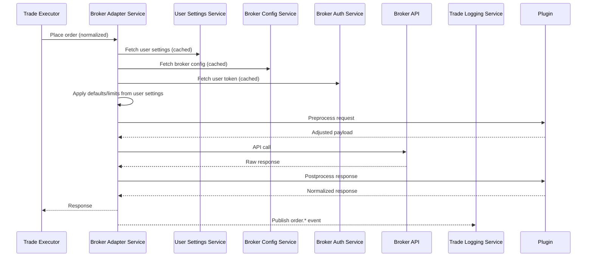

# 📘 Broker Adapter Service (BAS) – High-Level & Low-Level Design (Final)

## 1. 🎯 Purpose
The Broker Adapter Service (BAS) is a **config-driven execution service** that integrates SmartTrade with external broker APIs.  
It manages the **entire order lifecycle** and **portfolio/market data queries**, ensuring:

- **Broker-agnostic execution** (via config + plugins).  
- **Resilient, observable, and stateless service**.  
- **Validated and normalized order events** (`order.*`) for downstream consumers.  

---

## 2. 🔑 Responsibilities
- Load **broker configs** (API URLs, mappings, rules) from Broker Config Service.  
- Fetch and decrypt **user tokens** from Broker Auth Service.  
- Apply **user defaults** from User Settings (TIF, product type, etc.) if missing.  
- Execute **order lifecycle** operations:
  - Place, modify, cancel, query, exit, convert  
  - Funds, positions, holdings, trades  
- Apply **Rule Engine validations** (technical, config-driven).  
- Provide **plugin hooks** for broker-specific quirks (REST + WebSocket).  
- Publish normalized **order events** to Event Bus.  
- Expose **REST APIs** for Trade Executor.  
- Ensure **audit-first** design with filtering of sensitive fields.  

---

## 3. 🔗 Dependencies
- **Broker Config Service** → broker API configs + validations.  
- **Broker Auth Service** → tokens/credentials.  
- **User Settings Service** → defaults & user preferences.  
- **Trade Executor** → orchestrates order flows via BAS.  
- **Risk Engine** → validates trades against risk + effective capabilities.  
- **Journal Service** → consumes `order.*` events.  

---

## 4. Responsibilities & Boundaries (RACI)

| Responsibility                          | Risk Engine | Broker Adapter Service (BAS) | User Settings Service | Broker Config Service |
|----------------------------------------|-------------|-------------------------------|-----------------------|-----------------------|
| Define global application capabilities | C           | I                             | I                     | I                     |
| Define broker-specific capabilities    | I           | C                             | I                     | **R/A**               |
| Define user-specific capabilities      | I           | I                             | **R/A**               | C                     |
| Compute effective capability           | **R** (via common lib) | I                             | C                     | C                     |
| Enforce capability limits              | **R/A**     | I                             | C                     | I                     |
| Enforce financial risk limits          | **R/A**     | I                             | C                     | I                     |
| Apply defaults (e.g., TIF, product type) | C           | **R**                         | **A**                 | I                     |
| Apply technical validations (lot size, tick size) | C | **R**                         | I                     | **C**                 |
| Broker-specific quirks (REST/WS)       | I           | **R/A**                       | I                     | C                     |
| Order lifecycle execution              | I           | **R/A**                       | I                     | I                     |
| Publish order events (`order.*`)       | I           | **R/A**                       | I                     | I                     |

✅ Ensures **BAS = execution-only**, not risk/capability enforcement.

---

## 5. 🔄 Flow Overview


---

## 6. ⚡ Efficiency Enhancements
- **Rule Engine Precompile** → compile rules once at config load.  
- **Lazy Refresh for configs/tokens** → background refresh before TTL expiry.  
- **WS bounded queue + coalescing** → prevent overload from high-frequency updates.  
- **Async Event Publishing** → API response not blocked by event publishing.  
- **Observability Tuning** → structured logs, sampled tracing, INFO-level in prod.  
- **Broker API retry/backoff strategy** → exponential backoff (default 3 retries, capped at 5s) to avoid retry storms.  

---

## 7. 📂 Service Structure (LLD)
```
broker-adapter-service/
├── src/
│   ├── main.py                 # FastAPI entrypoint
│   ├── api/orders.py           # Routes (thin)
│   ├── core/
│   │   ├── adapter.py          # Core orchestration
│   │   ├── config_client.py    # Broker config loader + cache
│   │   ├── auth_client.py      # Token fetcher + cache
│   │   ├── user_settings_client.py  # User settings fetcher + cache
│   │   ├── rule_validator.py   # Precompiled rule engine
│   └── events/publisher.py     # Async event dispatcher
│
└── plugins/
    ├── base.py                 # Plugin template (placeholders)
    ├── fyers.py                # Fyers overrides
    ├── zerodha.py              # Stub with TODO markers
    └── angel.py                # Stub with TODO markers
```

---

## 8. Key Components

### **Config Client**
- Loads broker YAML, validates, caches.  
- Background refresh.  

### **Auth Client**
- Fetches tokens from Broker Auth.  
- Decrypts via common lib.  
- Caches with TTL.  

### **User Settings Client**
- Fetches user defaults (product type, TIF).  
- Caches settings.  
- Invalidates cache on `user.settings.updated` event.  

### **Rule Validator**
- Precompiled rules from broker config.  
- Validates requests & responses.  

### **Adapter Core**
- Full lifecycle orchestration.  

### **Plugin System**
- REST + WS hooks.  
- Broker-specific quirks only in plugins.  

### **Event Publisher**
- Async publishing of `order.*` events.  
- Sensitive fields stripped with `filter_data(..., safe=True)`.  

### **WS Handler**
- Plugin-managed subscriptions.  
- Bounded queue to prevent overload.  

---

## 9. REST API Endpoints

| Endpoint         | Purpose                         |
|------------------|---------------------------------|
| `POST /orders/place`  | Place new order              |
| `POST /orders/modify` | Modify existing order        |
| `POST /orders/cancel` | Cancel order                 |
| `GET /orders/{id}`    | Get order status             |
| `GET /positions`      | Fetch positions              |
| `GET /funds`          | Fetch funds                  |
| `GET /holdings`       | Fetch holdings               |

📌 **Defaults Example**:  
If `product_type` is missing in `place_order` request → BAS fills from User Settings (e.g., `INTRADAY`).  

---

## 10. Error Handling
- Use `SmartTradeError` consistently.  
- Map broker/system errors to SmartTrade codes.  
- Propagate `X-Trace-ID`.  
- Publish audit events on errors/denials.  

---

## 11. Observability
- Structured JSON logs.  
- Prometheus metrics:
  - `bas_requests_total{operation,status}`  
  - `bas_validation_failures_total{rule}`  
- OpenTelemetry spans for broker API + WS.  
- `/`, `/ready`, `/metrics` endpoints.  

---

## 12. Testing
- Unit tests → models, configs, plugins.  
- Contract tests → BAS ↔ Auth/Config/User Settings.  
- Mock broker REST/WS → `httpx_mock`.  
- Self-tests → run config examples (e.g., `fyers.yaml`).  
- Fixtures for User Settings defaults included.  

---

## 13. Deployment
- Multi-stage Dockerfile.  
- `docker-compose.override.yml` for local dev.  
- GitHub Actions pipeline:
  - Run unit + contract tests.  
  - Coverage ≥80%.  
  - Run config self-tests (reject PR if YAML invalid).  

---

# ✅ Key Takeaways
- BAS = **execution-only**.  
- Risk & capabilities enforced upstream by Risk Engine.  
- User defaults filled from User Settings.  
- Broker quirks isolated in plugins.  
- Efficiency features baked in (caching, precompile, async, backoff).  
- CI/CD validates configs and tests coverage.  