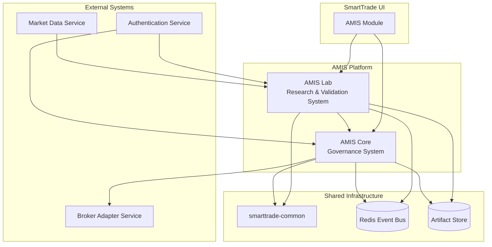
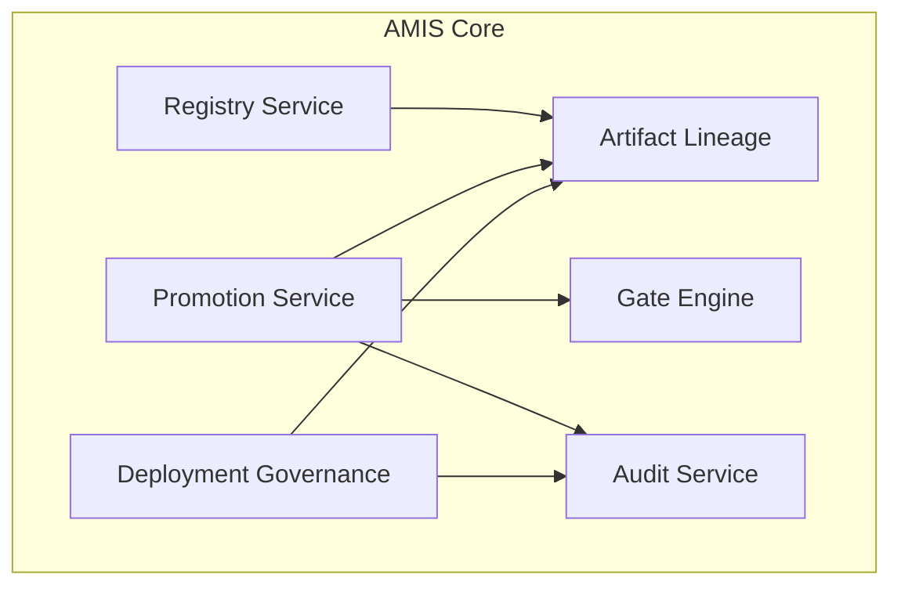
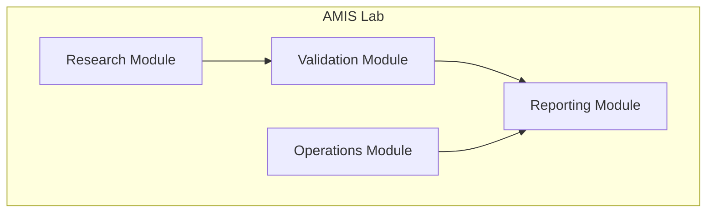
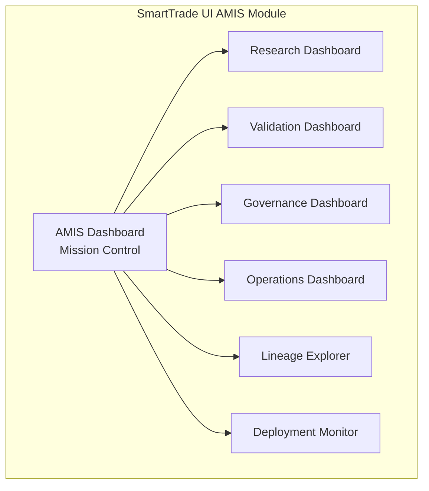
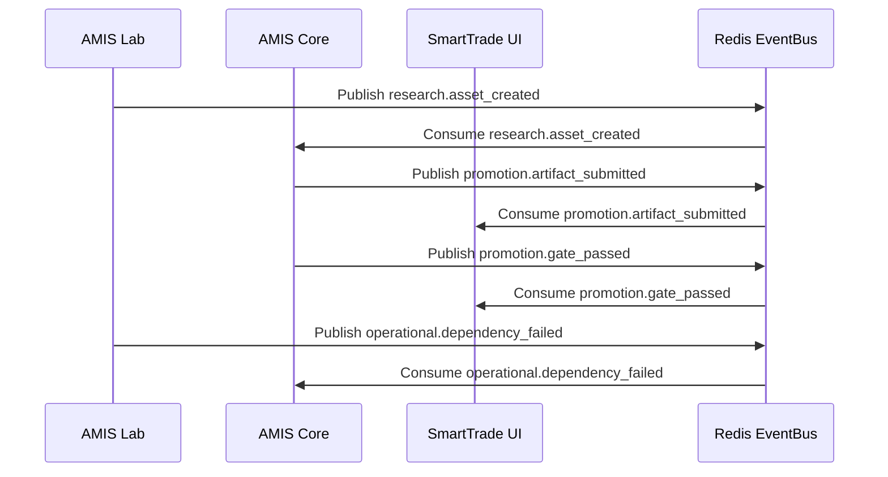
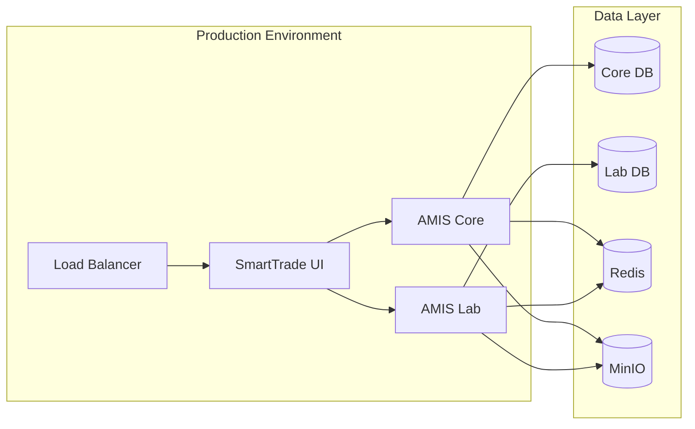

# AMIS Platform High Level Design (HLD)

**Document Version**: 1.3  
**Date**: 2026-06-16  
**Status**: Final HLD  
**Related Documents**: [AMIS Platform Architecture v2.1](./2026-06-16-amis-platform-v1.md)  
**Scope**: High-level design for AMIS Core, AMIS Lab, and SmartTrade UI AMIS Module  
**Audience**: Engineering Team, Research Team, Operations Team, Product Owner  

---

## Table of Contents

1. [Executive Summary](#1-executive-summary)
2. [System Overview](#2-system-overview)
3. [Architecture Principles](#3-architecture-principles)
4. [Component Architecture](#4-component-architecture)
5. [Service Interactions](#5-service-interactions)
6. [Data Architecture](#6-data-architecture)
7. [Security Architecture](#7-security-architecture)
8. [Deployment Architecture](#8-deployment-architecture)
9. [Non-Functional Requirements](#9-non-functional-requirements)

---

## 1. Executive Summary

### 1.1 Purpose

AMIS (AI Market Intelligence System) is a **Decision Governance Platform for Algorithmic Trading** that provides systematic validation, promotion, and deployment governance for AI trading models and research assets.

### 1.2 Key Design Decisions

1. **Two-Service Architecture**: AMIS Core (Governance) + AMIS Lab (Research/Validation)
2. **No Separate Operations Service**: Operational capabilities live in AMIS Lab
3. **No Separate UI Service**: AMIS is a module inside SmartTrade UI
4. **ResearchContext as Root Artifact**: Immutable contract preserving validated research assumptions
5. **ResearchAsset as First-Class Artifact**: Knowledge survives even when models fail
6. **ExperimentArtifact as First-Class Artifact**: Experiments become searchable, versioned assets
7. **Candidate Registration in Core**: Candidates registered as governance artifacts for lineage
8. **Report Artifacts in Core**: Reports are immutable artifacts for promotion traceability
9. **Research Program Management in Core**: Programs, Tracks, Milestones for R&D control tower
10. **Mandatory Gate 0**: Dependency health blocking with no overrides
11. **Mandatory Gate 1 (Context Compatibility)**: Deployment context must match validated research context
12. **Mandatory Regime Governance**: VIX, Volatility, Market Structure, HTF Alignment required

### 1.3 Success Criteria

- 100% of production decisions traceable through lineage
- 100% of dependency failures block promotion (Gate 0)
- 100% of research includes mandatory regime governance
- Zero operational dependencies in research path
- All governance decisions data-driven and auditable

---

## 2. System Overview

### 2.1 System Context



### 2.2 Service Boundaries

| Service | Responsibility | Must Never |
|---------|---------------|------------|
| **AMIS Core** | Governance (Registry, Promotion, Gates, Audit, Lineage) | Train models, run validation, calculate VIX, perform research |
| **AMIS Lab** | Research, Validation, Operations (within Lab) | Make production deployment decisions |
| **SmartTrade UI** | AMIS Module (Dashboard, Research, Validation, Governance, Operations) | Direct service communication (via APIs only) |

### 2.3 Key Flows

**Research Flow**: Research → Validation → Regime Analysis → Promotion Request → Gate Evaluation → Deployment

**Governance Flow**: Artifact Registration → Scorecard Submission → Gate Evaluation → Promotion Decision → Deployment

**Operational Flow**: Dependency Monitoring → Health Validation → Incident Management → Gate 0 Blocking

---

## 3. Architecture Principles

### 3.1 Core Principles

1. **Keep it Simple**: Avoid unnecessary complexity
2. **Separate Governance from Research**: Clear boundary between Core and Lab
3. **Use Common Library First**: All shared contracts in smarttrade-common
4. **Decision Traceability**: Every production decision must be explainable
5. **Data-Driven Governance**: All governance decisions must be auditable

### 3.2 Design Patterns

- **Content-Addressable Identity**: Cryptographic hashes for artifact immutability
- **Event-Driven Communication**: Redis EventBus for async communication
- **Repository Pattern**: Generic repository base classes from smarttrade-common
- **Gate Pattern**: Configurable, pluggable gate evaluation framework
- **Lineage Pattern**: Parent-child graph for complete artifact tracking

### 3.3 Technology Stack

- **Backend**: FastAPI + Python 3.12
- **Database**: PostgreSQL (database-per-service)
- **Event Bus**: Redis (EventBus + BaseStreamConsumer patterns)
- **Storage**: Filesystem (V1), MinIO/S3 (future)
- **Frontend**: React 18 + TypeScript (module in SmartTrade UI)
- **Shared Library**: smarttrade-common

---

## 4. Component Architecture

### 4.1 AMIS Core Components



**Registry Service**
- Immutable artifact registry (ResearchContext, RegimeDefinition, ExecutionProfile, FeatureSchema, LabelVersion, Dataset, ModelArtifact, ResearchAsset, ExperimentArtifact, CandidateArtifact, ReportArtifact)
- Content-addressable identity (hash-based)
- Complete lineage tracking
- Research Context Governance (ResearchContext as root of all research and deployment lineage)
- Regime Definition Governance (reusable regime definitions)
- Execution Profile Governance (execution parameters separate from research context)
- Research Program Management (ResearchProgram, ResearchTrack, ResearchMilestone)
- Candidate State Machine (DRAFT → RESEARCHING → VALIDATING → SHADOW → PRODUCTION_CANDIDATE → PRODUCTION, with REJECTED terminal state)

**Promotion Service**
- Gate evaluation orchestration
- Promotion decision workflow (with evidence locking via evidence_hash)
- Deployment orchestration
- Rollback management

**Gate Engine**
- Configurable gate definitions
- Pluggable gate evaluators
- Gate 0 (MANDATORY, no overrides): Dependency Health
- Gate 1 (MANDATORY, no overrides): Context Compatibility — deployment context must match validated Research Context
- Gate 2 (Research Validation)
- Gate 3 (Shadow Validation)
- Gate 4 (Human Approval)

**Artifact Lineage**
- Parent-child graph for ALL artifacts (Core is the single lineage authority)
- Research lineage (ResearchContext → FeatureSchema → Dataset → TrainingRun → ModelArtifact → PromotionDecision)
- Deployment lineage (ResearchContext → OperatingEnvelopeVersion → ShadowValidationRun → ProductionDeployment)
- Operational lineage (DependencyDefinition → DependencyValidationRun → DependencyIncident)
- Candidate lineage (CandidateArtifact → ExperimentArtifact → Validation → ResearchAsset)
- Program lineage (ResearchProgram → ResearchTrack → ResearchMilestone → Artifacts)

**Audit Service**
- Immutable audit log (append-only)
- Complete action tracking
- User attribution

**Deployment Governance**
- Deployment safety checks
- Operating envelope management (opaque JSON stored by Core, defined by Lab)
- Rollback management

### 4.2 AMIS Lab Components



**Research Module**
- Candidate Research (lifecycle management)
- Feature Engineering (extraction, dataset generation)
- Training (training runs, model artifacts)
- Feature Families (feature group management)

**Validation Module**
- Walk Forward Validation (multi-window)
- Temporal Validation (time-based)
- Regime Validation (VIX, Volatility, Market Structure, HTF Alignment)
- Shadow Validation (shadow mode performance)

**Operations Module**
- Dependency Monitoring (health checks, status aggregation)
- Incident Management (lifecycle, escalation)
- Dependency Validation (validation runs, snapshots)
- Data Reliability Monitoring (quality, gaps, latency)

**Reporting Module**
- Research Reports (automated generation)
- Validation Reports (scorecards, gate results)
- Regime Reports (regime analysis, VIX analysis)
- Shadow Reports (shadow performance, drift analysis)

### 4.3 SmartTrade UI AMIS Module Components



**AMIS Dashboard (Mission Control)**
- Research Assets overview
- Production Candidates
- Production Models
- Open Incidents
- Dependency Health
- Shadow Validation Status
- Promotion Queue

**Research Dashboard**
- Candidate creation wizard
- Experiment tracking
- Validation job monitoring
- Research report generation

**Validation Dashboard**
- Validation job tracking
- Regime analysis visualization
- Shadow validation monitoring
- Performance metrics

**Governance Dashboard**
- Promotion request list
- Gate evaluation visualization
- Approval/rejection workflow
- Rollback management

**Operations Dashboard**
- Dependency health visualization
- Incident tracking
- Data reliability metrics
- Alert configuration

**Lineage Explorer**
- Research lineage visualization
- Operational lineage visualization
- Impact analysis
- Decision traceability

**Deployment Monitor**
- Current production artifact
- Deployment history
- Operating envelope status
- Rollback status

---

## 5. Service Interactions

### 5.1 Synchronous Interactions

**AMIS Lab → AMIS Core**
- Artifact registration (REST API)
- Promotion submission (REST API)
- Scorecard submission (REST API)
- Lineage queries (REST API)

**SmartTrade UI → AMIS Core**
- Governance dashboard data (REST API)
- Promotion workflow (REST API)
- Lineage queries (REST API)
- Audit log queries (REST API)

**SmartTrade UI → AMIS Lab**
- Research dashboard data (REST API)
- Validation dashboard data (REST API)
- Operations dashboard data (REST API)
- Report generation (REST API)

### 5.2 Asynchronous Interactions

**EventBus Pattern** (Domain Events)



**Key Events**:
- `research.asset_created` - Lab publishes, Core subscribes
- `research.validation_completed` - Lab publishes, Core subscribes
- `promotion.artifact_submitted` - Core publishes, UI subscribes
- `promotion.gate_passed` - Core publishes, UI subscribes
- `promotion.decision_made` - Core publishes, Lab subscribes
- `operational.dependency_failed` - Lab publishes, Core subscribes
- `operational.incident_created` - Lab publishes, UI subscribes

**BaseStreamConsumer Pattern** (Market Data)

- `market.quote` - Lab consumes for real-time analysis
- `market.candle` - Lab consumes for historical backfill

### 5.3 External Service Integration

**Market Data Service (MDS)**
- AMIS Lab consumes `market.quote` and `market.candle`
- Used for feature extraction, validation, and operational monitoring

**Authentication Service**
- AMIS Core and AMIS Lab use JWT validation
- RBAC via shared JWT secret

**Broker Adapter Service (BAS)**
- AMIS Core deploys production models to BAS
- BAS executes trades based on production models

---

## 6. Data Architecture

### 6.1 Database Architecture

**Database-per-Service Pattern**:
- `smarttrade_amis_core` - AMIS Core database
- `smarttrade_amis_lab` - AMIS Lab database

**No cross-database queries** - Services communicate via APIs and events.

### 6.2 Core Data Models

**AMIS Core Entities**:
- Registry Artifacts: FeatureSchema, LabelVersion, StopConstraintVersion, Dataset, TrainingRun, ModelArtifact
- Governance Artifacts: ResearchAsset, PromotionScorecard, PromotionDecision, GateDefinition, AuditLog
- Deployment Artifacts: OperatingEnvelopeVersion, ProductionDeployment
- Lineage: ArtifactLineage

**AMIS Lab Entities**:
- Research: Candidate, Experiment, FeatureFamily
- Validation: ValidationJob, RegimeAnalysis, VIXAnalysis
- Operations: DependencyDefinition, DependencyValidationRun, DependencyValidationSnapshot, DependencyIncident
- Reporting: ResearchReport, ValidationReport, RegimeReport, ShadowReport

### 6.3 Data Flow

**Research Data Flow**:
```
Market Data → Feature Extraction → Dataset → Training → Model Artifact → Validation → Promotion → Deployment
```

**Operational Data Flow**:
```
Dependency Definition → Health Check → Validation Run → Snapshot → Incident (if failed)
```

**Governance Data Flow**:
```
Artifact Registration → Lineage Tracking → Gate Evaluation → Promotion Decision → Audit Log
```

### 6.4 Data Consistency

**Eventual Consistency**:
- Services communicate via events for eventual consistency
- Critical operations use synchronous APIs for strong consistency
- Audit log provides immutable record of all state changes

**Immutability**:
- All registry artifacts are immutable (content-addressable)
- Audit log is append-only
- Lineage graph is append-only (new relationships added, never removed)

---

## 7. Security Architecture

### 7.1 Authentication

**JWT-based Authentication**:
- Shared JWT secret with Authentication Service
- Service-to-service authentication using service accounts
- Token-based authorization with role claims

### 7.2 Authorization

**RBAC Model**:
- `amis_researcher` - Create candidates, run experiments, submit artifacts
- `amis_reviewer` - Review artifacts, approve/reject promotions
- `amis_operator` - Monitor operations, manage incidents
- `amis_admin` - Full administrative access
- `amis_lab_pipeline` - Service account for Lab automation
- `amis_core_pipeline` - Service account for Core automation

### 7.3 Audit Trail

**Comprehensive Audit Logging**:
- All governance actions logged
- User attribution for all actions
- Immutable audit log (append-only)
- Query and export capabilities

### 7.4 Data Security

**Encryption**:
- Encryption at rest (PostgreSQL)
- Encryption in transit (TLS)
- Secret management via environment variables

**Access Control**:
- Database access restricted to service accounts
- API access restricted via RBAC
- Artifact access restricted via ownership and permissions

---

## 8. Deployment Architecture

### 8.1 Deployment Topology



### 8.2 Service Ports

| Service | Internal Port | External Port |
|---------|---------------|---------------|
| AMIS Core | 8000 | 8015 |
| AMIS Lab | 8000 | 8016 |
| SmartTrade UI | — | 5173 |

### 8.3 Deployment Strategy

**Blue-Green Deployment**:
- Zero-downtime deployments
- Gradual traffic shift
- Instant rollback capability

**Database Migrations**:
- Alembic for schema migrations
- Backward-compatible migrations
- Migration rollback capability

**Configuration Management**:
- Environment-based configuration
- Configuration via environment variables
- No secrets in code

---

## 9. Non-Functional Requirements

### 9.1 Performance

**Response Time**:
- API responses < 200ms (p95)
- Gate evaluation < 1s
- Report generation < 30s

**Throughput**:
- 1000+ artifacts registered per day
- 100+ promotion decisions per day
- 10000+ validation jobs per day

**Scalability**:
- Horizontal scaling for stateless services
- Database connection pooling
- Redis clustering for event bus

### 9.2 Reliability

**Availability**:
- 99.9% uptime target
- Graceful degradation on dependency failures
- Circuit breakers for external service calls

**Fault Tolerance**:
- Automatic retry with exponential backoff
- Dead letter queues for failed events
- Health checks and auto-healing

**Disaster Recovery**:
- Database backups (daily, retained 30 days)
- Artifact store replication
- Multi-region deployment (future)

### 9.3 Maintainability

**Code Quality**:
- Follow SmartTrade coding standards
- Comprehensive unit tests (>80% coverage)
- Integration tests for critical paths
- E2E tests for cross-service workflows

**Documentation**:
- API documentation (OpenAPI/Swagger)
- Architecture documentation (this HLD)
- Service-specific documentation (in service repos)
- Runbooks for operational procedures

**Monitoring**:
- Application metrics (Prometheus)
- Distributed tracing (OpenTelemetry)
- Log aggregation (ELK stack)
- Alerting (PagerDuty)

### 9.4 Security

**Compliance**:
- Audit trail for all governance actions
- Data encryption at rest and in transit
- Regular security audits
- Penetration testing

**Vulnerability Management**:
- Dependency scanning
- Regular security updates
- Vulnerability response process

---

## Appendix A: Service Communication Matrix

| From | To | Protocol | Purpose |
|------|-----|----------|---------|
| AMIS Lab | AMIS Core | REST (Sync) | Artifact registration, promotion submission |
| AMIS Lab | AMIS Core | EventBus (Async) | Research events, validation events |
| AMIS Lab | Market Data Service | BaseStreamConsumer | Market data consumption |
| SmartTrade UI | AMIS Core | REST (Sync) | Governance dashboard data |
| SmartTrade UI | AMIS Lab | REST (Sync) | Research/Operations dashboard data |
| SmartTrade UI | AMIS Core | EventBus (Async) | Promotion event consumption |
| SmartTrade UI | AMIS Lab | EventBus (Async) | Operational event consumption |
| AMIS Core | Broker Adapter Service | REST (Sync) | Production model deployment |

## Appendix B: Data Ownership Matrix

| Data | Owner | Consumer | Access Pattern |
|------|-------|----------|----------------|
| Registry Artifacts | AMIS Core | AMIS Lab, SmartTrade UI | Read (Lab/UI), Write (Core) |
| Promotion Decisions | AMIS Core | AMIS Lab, SmartTrade UI | Read (Lab/UI), Write (Core) |
| Research Artifacts | AMIS Lab | AMIS Core, SmartTrade UI | Read (Core/UI), Write (Lab) |
| Validation Results | AMIS Lab | AMIS Core, SmartTrade UI | Read (Core/UI), Write (Lab) |
| Operational Data | AMIS Lab | AMIS Core, SmartTrade UI | Read (Core/UI), Write (Lab) |
| Audit Log | AMIS Core | SmartTrade UI | Read (UI), Write (Core) |

## Appendix C: Technology Stack Summary

| Layer | Technology |
|-------|------------|
| Backend Framework | FastAPI |
| Language | Python 3.12 |
| Database | PostgreSQL |
| Event Bus | Redis |
| Storage | Filesystem (V1), MinIO/S3 (future) |
| Frontend | React 18 + TypeScript |
| Shared Library | smarttrade-common |
| Package Manager | uv |
| API Documentation | OpenAPI/Swagger |
| Testing | pytest |
| Code Quality | ruff, mypy |
| Monitoring | Prometheus, OpenTelemetry |
| Logging | ELK stack |

---

**Document Status**: Final HLD  
**Related Architecture Document**: [AMIS Platform Architecture v2.1](./2026-06-16-amis-platform-v1.md)  
**Next Steps**: Implementation Priority 1 (Core Foundation)  
**Contact**: Architecture Team  
